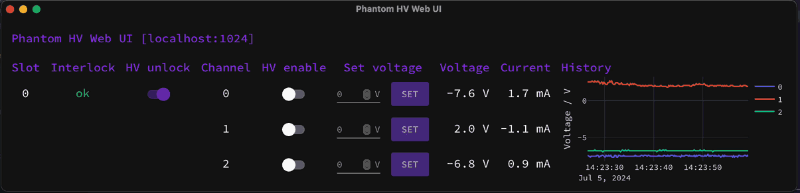

# Phantom HV Control & Monitoring Software

Software to control and monitor a Phantom HV crate via Ethernet.

## Installation

You can find the newest packaged release of this library on
[PyPi](https://pypi.org/project/phantom-hv/).

Install via `pip install phantomhv`.

Upgrade to the newest release with `pip install -U phantomhv`.

## Requirements

- Python 3 for the core library and command-line interface
- nicegui, pywebview, plotly and numpy for the Web UI (install via conda/mamba
  or pip)

## Tools

If installed via pip this library provides two tools:

- `phantomhv-ctl` is a command-line interface to control and monitor a Phantom
  HV module
- `phantomhv-webui` provides a web interface with realtime plotting

### `phantomhv-ctl` command-line tool

```
usage: phantomhv-ctl [-h] [--slot {0,1,2,3,4,5,6,7}] [--monitor] [--monitor-adcs] [--monitor-interval dt] [--set-dac dac,level] [--boot]
                     [--reset] [--flash FLASH] [--unlock-hv] [--lock-hv] [--enable-hv {0,1,2}] [--disable-hv {0,1,2}]
                     address

positional arguments:
  address               IP address or hostname of the master module

options:
  -h, --help            show this help message and exit
  --slot {0,1,2,3,4,5,6,7}
                        module slot to communicate with
  --monitor             continuously read and print slave states
  --monitor-adcs        continuously read and print slave ADC readings
  --monitor-interval dt
                        set monitoring interval (default: 1 s)
  --set-dac dac,level   set output level (0-4095) of DAC (0-3)
  --boot                boot application slot
  --reset               reset into bootloader
  --flash BIN_IMAGE     flash binary firmware image into application slot
  --unlock-hv           enable HV
  --lock-hv             disable HV
  --enable-hv {0,1,2}   enable HV channel
  --disable-hv {0,1,2}  disable HV channel
```

### `phantomhv-webui` web interface



```
usage: phantomhv-webui [-h] [-n {1,2,3,4,5,6,7,8}] [-s | -b hostname:port] ip:port

positional arguments:
  ip:port               IP address or hostname of the master module (default port: 512)

options:
  -h, --help            show this help message and exit
  -n {1,2,3,4,5,6,7,8}, --num-slots {1,2,3,4,5,6,7,8}
                        number of module slots to display
  -s, --show            open UI in native window
  -b hostname:port, --bind hostname:port
                        bind web server to a specific network interface/port (default: 127.0.0.1:8080; use 0.0.0.0 to bind to all interfaces)
```
